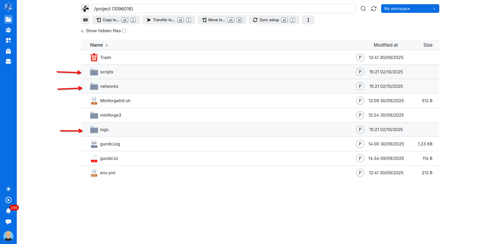
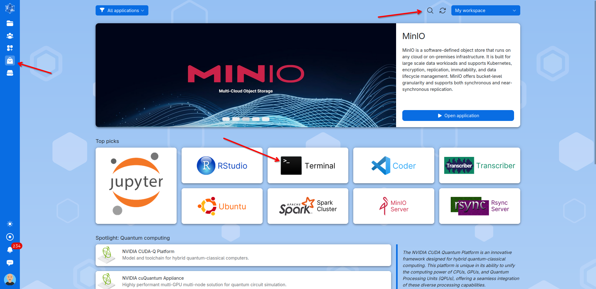
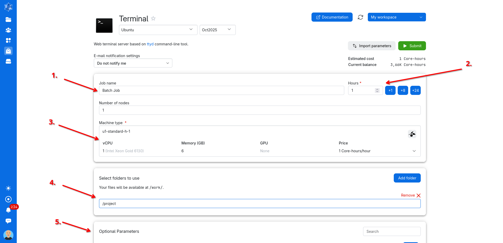
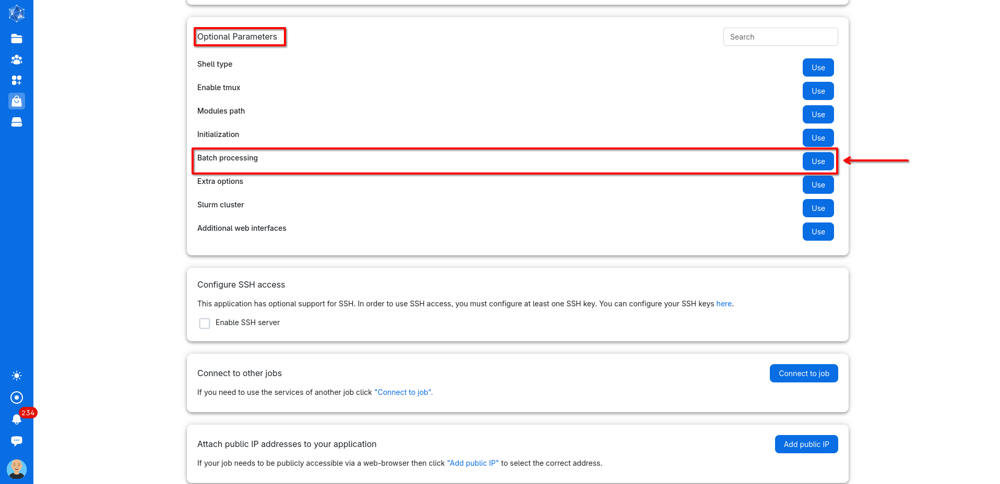
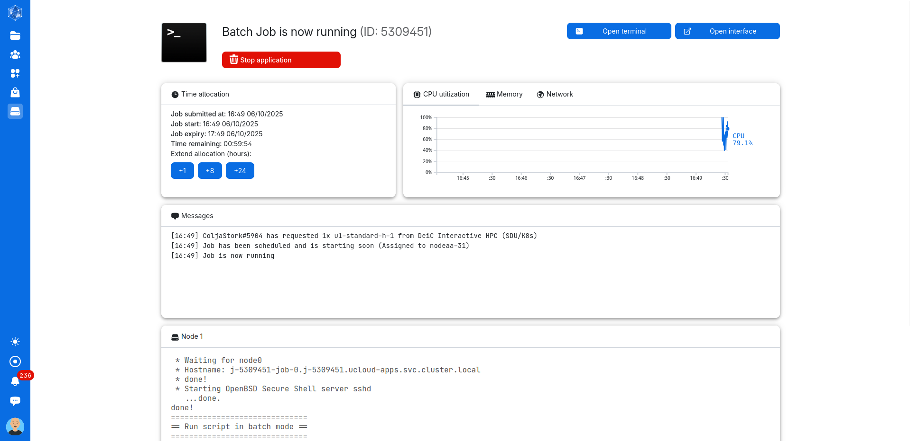

**[Tutorial:]{.underline} Setting up Gurobi license**

**1. Signing up and selecting license**

Sign up for a Gurobi license at <https://portal.gurobi.com/iam/login/> . Fill out the ***Contact*** tab by preferably use your university email address to do so. For the country select the country of the University you want to connect to the license, meaning for Aarhus University choose Denmark.

In the Your Work tab select your University, academic position and other relevant information. Afterwards agree to the terms of service and create your account.

Once you have successfully created the account and logged in, from the user portal navigate to ***Licenses*** and then ***Request***. Here choose the ***WLS Academic License*** and click ***Generate Now.***

Once the license is generated. Click on Licenses and navigate to the Web License Manager by clicking on the little box next to your WLS license.

In the now newly opened window go to your license and press download. *(Note: this is also where you will be able to extend your license as these only run for a couple of months.)*

**2. Connecting license**

Once you have downloaded the gurobi.lic license file, you need to store it in a location where Gurobi can find it. Storing the license file in a default location is recommended. The default directories where Gurobi will search for a gurobi.lic license file are:

Windows: C:\\gurobi and your home directory (C:\\Users\\yourusername)

Linux: /opt/gurobi and your home directory (/home/yourusername)

macOS: /Library/gurobi and your home directory (/Users/yourusername)

Placing the license file in one of these default directories is the simplest and most reliable approach. *(Note: Having and only placing one copy of the license file is recommended as it makes troubleshooting and updating license files easier).*

The license file can also be stored in a custom location. In this case it is important to explicitly tell Gurobi where to find it. This is also good practice also when the file is placed in a default location. For this you need to first activate the Python environment where Gurobi is installed:

*conda activate [\<your-environment\>]{.mark}*

Then set the environment variable to the license file's path (update to a default path or your custom path):

*export GRB_LICENSE_FILE=[/path/to/license/file/]{.mark}gurobi.lic*

Lastly confirm that Gurobi is using the correct license by running:

*gurobi_cl*
