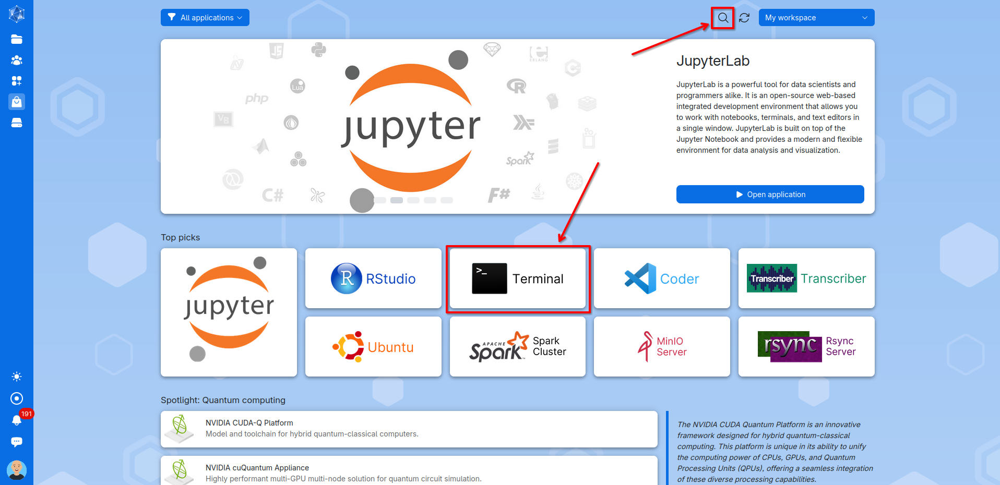
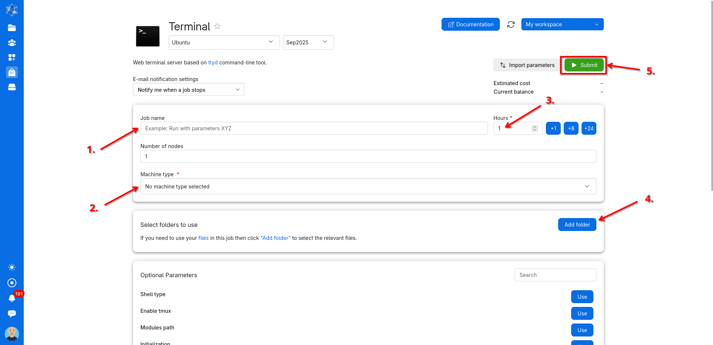
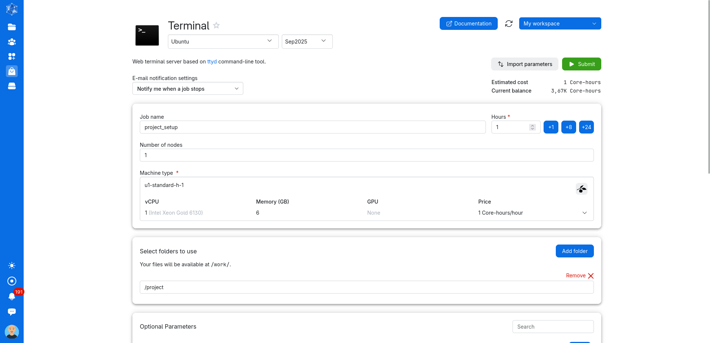
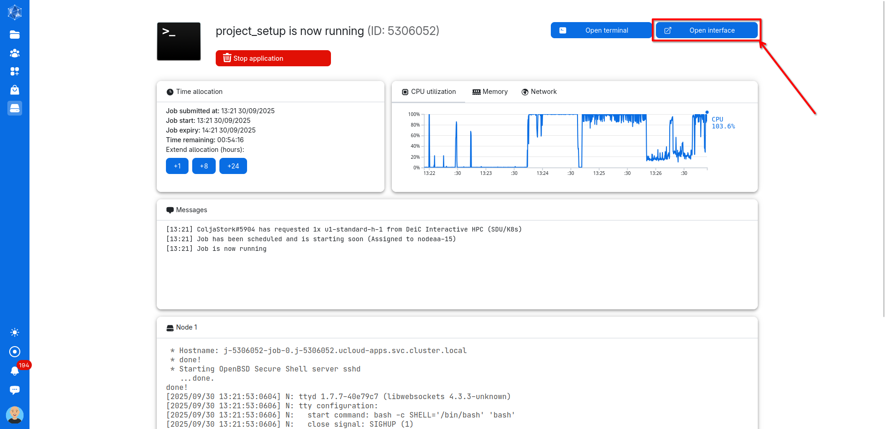
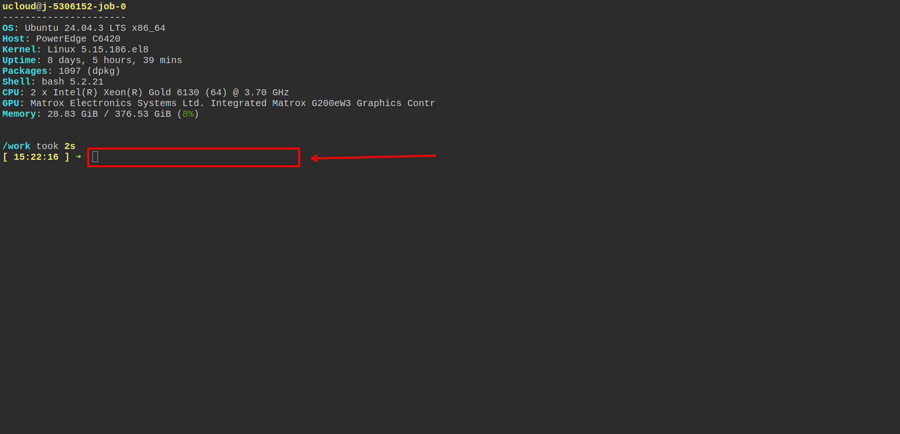
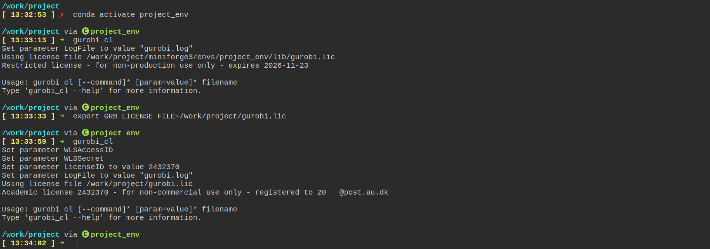
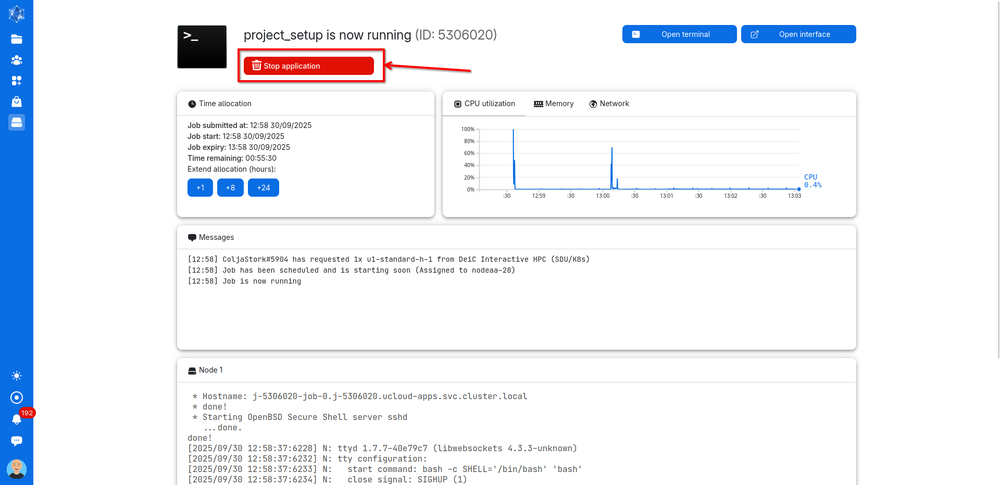
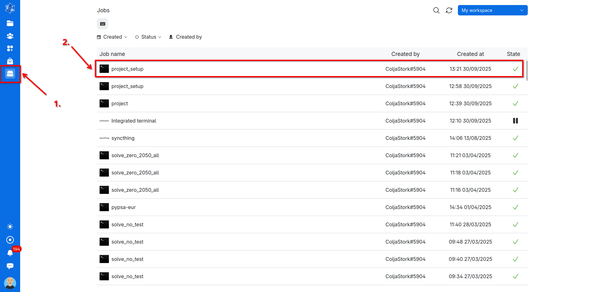
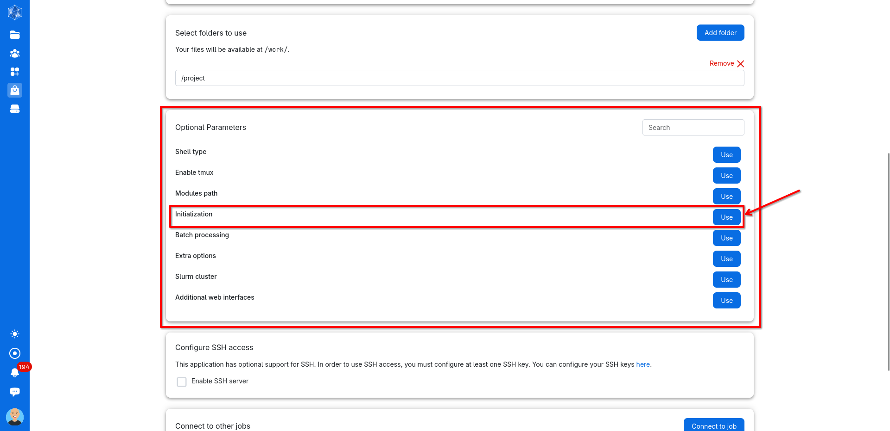
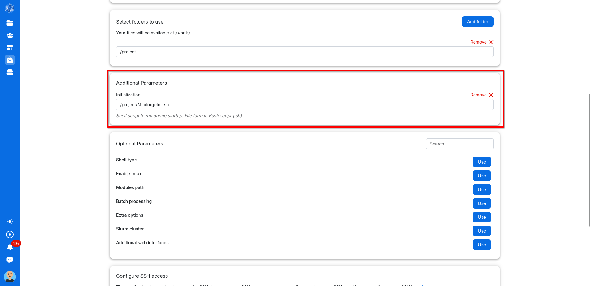

**[Tutorial:]{.underline} Setting up processes on the server cluster**

**1. Working directory and uploading files**

Log into the server cluster website at <https://cloud.sdu.dk/> with your uni login. From the main page navigate to the ***Files*** tab.

In the files tab create a new folder for your project by clicking on ***Create drive*** or pressing ***ALT+q***.

Give your project folder a name and click ***Create***.

Double click to go inside the newly created project folder. Populate the folder with your local files by uploading either through pressing ***ALT+u*** or by clicking on ***Upload files***. You can upload the standard python environment file (project.env) and initialization bash script (init.sh) from the Github repository. Create your desired file structure by adding sub-folders if necessary.

**2. Setup Python and install custom environment**

To set up Python permanently in your project folder and install your custom environments, you need to start a server process with a terminal window. *(Note: It's now also possible to launch lightweight terminal processes directly from the project folder. However, these have strict memory limits and often cause issues, so we don't recommend using them at this time.)*

To do so navigate to the **Applications** tab.

Find and click on the ***Terminal*** application or search for the application in the ***Search*** bar.

In the setup window for the terminal server process, you'll need to configure the following options:

1.  **Process name**: Choose a name for your process.

2.  **Machine type:** Select the smallest machine, since the setup and installation don't require much processing power or resources.

3.  **Runtime duration:** Set how long the process should run. One hour is usually more than enough. *(Note: Any unused time after the process ends will not be deducted from your balance.)*

4.  **Working folder:** Select your newly created project directory as the starting folder.

5.  **Submit**: Click Submit to launch the process.

The final setup of the terminal server process should look something like this. Now press **Submit**.

A new process window will automatically open. Here click ***Open Interface*** to open and access the terminal in a new window. *(Note: It is also possible to run the terminal from the **Open Terminal** button but this terminal has issues with disconnecting so its not recommended for longer processes like installations.)*

In the now newly opened terminal window a sequence of different commands need to be run to install python and setup the wanted environment including Gurobi. Run all the commands by copying them into the terminal using ***CTRL+c*** and ***CTRL+SHIFT+v*** and pressing enter.

We'll use Miniforge to install Python and Conda on the server. Get the necessary miniforge files by running:

> *curl -L -O \"https://github.com/conda-forge/miniforge/releases/latest/download/Miniforge3-\$(uname)-\$(uname -m).sh\"*

Install Miniforge into your project folder *(Note: Replace /work/project/miniforge3 with the path to your project directory)*:

*bash Miniforge3-\$(uname)-\$(uname -m).sh -b -f -p /work[/project/]{.mark}miniforge3*

Enable Conda in the current shell session:

*eval \"\$(/work[/project/]{.mark}miniforge3/bin/conda shell.bash hook)\"*

(Optional) Install Mamba for faster package management and environment creation:

*mamba -n base -c conda-forge*

Now you're ready to create your Python environment. You can either set it up manually, or (recommended) use an environment file that lists all required channels and packages. An example file is provided in the GitHub repository and was uploaded earlier in this tutorial. To install the environment from that file, run:

*mamba env create -f [project/]{.mark}env.yml*

*(Note: if the install fails, errors occur or you want to redo the installation, the environment can be removed by running: conda remove \--name ENV_NAME \--all)*

Your environment can now be activated by running:

*conda activate [project_env]{.mark}*

To use gurobi a license needs to be uploaded. We recommend uploading it to your project folder. Gurobi can then be connected to the license by running:

*export GRB_LICENSE_FILE=/work[/project/]{.mark}gurobi.lic*

Initialize gurobi to check if it was succesful:

*gurobi_cl*

You can now run commands and scripts using the Python environment on the server. When you're finished, return to the process window and press and hold the Stop application button to end the server process.

**3. Setup initialization script**

To keep the Conda environment active and Gurobi initialized, you can create a bash script that automatically: Initializes Miniforge, Activates your Conda environment, sets the Gurobi license path and registers the Jupyter kernel (check Jupyter Tutorial).

Upload a script like the following one also found in the github repository (adjust the paths to match your project):

> #!/bin/bash
>
> \# Set up Miniforge
>
> source /work[/project/]{.mark}miniforge3/etc/profile.d/conda.sh
>
> export PATH=/work[/project/]{.mark}miniforge3/bin:\$PATH
>
> \# Initialize Conda
>
> eval \"\$(/work[/project/]{.mark}miniforge3/bin/conda shell.bash hook)\"
>
> \# Activate the Conda environment
>
> conda activate [project_env]{.mark}
>
> \# Set Gurobi license path
>
> export GRB_LICENSE_FILE=/work[/project/]{.mark}gurobi.lic
>
> \# Register Jupyter kernel
>
> python -m ipykernel install \--user \--name [project_env]{.mark} \--display-name \"Python ([project_env]{.mark})\"

This script is then initialized with every server run.

This is done by rerunning our previous terminal server process. Go to the ***Runs*** tab and in the list of processes click on the one you want to run again. *(Note: this is also generally useful when wanting to run similar processes again, just select one from the list and adjust the process parameters as needed and run the process).*

In the process window scroll down to ***Optional Parameters*** and select ***Initialization*** by clicking on ***Use.***

A new initialization box appears. Here navigate to and select the bash script.

Now, when you run the terminal process again, Conda, your Python environment, and the Gurobi license should all be initialized automatically. Update: In some cases, setting the Gurobi license through the script may not work. If that happens, simply activate your Python environment and reset the license manually with:

*export GRB_LICENSE_FILE=/work/project/gurobi.lic*

You can now run your processes through the terminal processes on the server. If you want to run Jupyter on the server check out the ***Jupyter Tutorial.*** For automatically running Python scripts, where the server process ends on completion or failure, take a look at the ***Batch Processing Tutorial.***

Explain how to run jupyter on the cluster

Connect your jupyter to ur existing installed python environment using ipkernel\...

Explain how to create networks with pypsa-eur

How to get a gurobi licens

Create account at gurobi with uni login.

Create WLS licens

\...

Bacth runs

Upload script that includes the code to run the operation you wanna run

Upload bash script that includes code that tells the server what script to run and where to save outputs like logfiles. Example given below for solving a network using pypsa and gurobi. initiliaze it when starting the server process. It will start and stop by itself.
